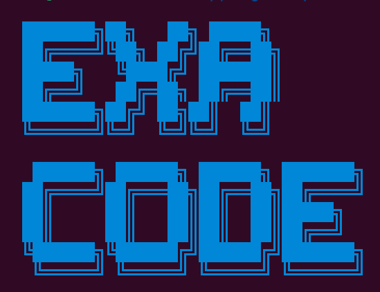
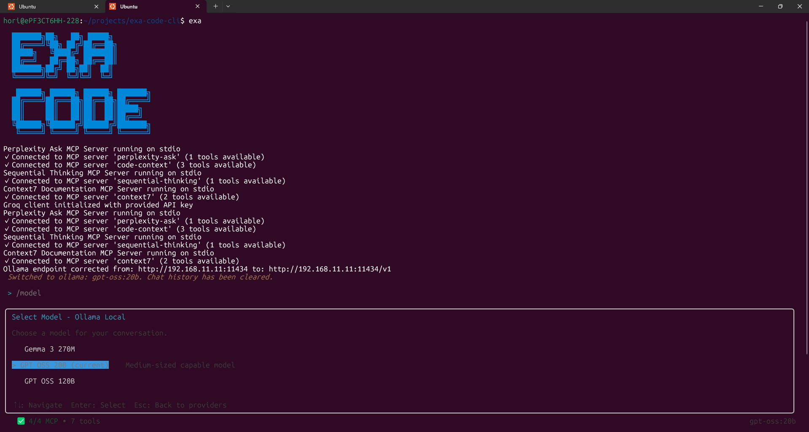

<h2 align="center">
  
 
  
  
Exa Code CLI: <a href="https://github.com/build-with-groq/groq-code-cli">Groq Code CLI</a> v1.0.2をベースとした、カスタマイズ可能で軽量なオープンソースのコーディングCLI
  
</h2>

 
 

 <a href="#概要">概要</a> •
 <a href="#インストール">インストール</a> •
 <a href="#使い方">使い方</a> •
 <a href="#開発">開発</a>

 

# 概要

Groq Code CLIの[README.md](https://github.com/build-with-groq/groq-code-cli/blob/main/README.md)には以下の記述があります。

> Groq Code CLI は、CLI を真に自分好みにカスタマイズするチャンスです。現在お使いの CLI で馴染みのある機能、ツール、コマンド、UI/UX をすべて備えているため、常に欲しかった新機能を簡単に追加できます。品質を損なうことなく、コード量と肥大化を大幅に削減することで、この CLI を思い通りにカスタマイズできます。Groq のモデルを活用することで、反復処理をさらに高速化できます（/models利用可能なモデルについては、こちらをご覧ください）。ターミナルに入力するだけで CLI を起動できますgroq。他のコーディング用 CLI と同様に、任意のディレクトリで Groq Code CLI を使用できます。

Exa Code CLI は、Groq CodeCLI v1.0.2 をベースに、以下のようなカスタマイズを施したものです。
- スタートアップの ASCII アートを Exa に変更
- スタートアップコマンドを `exa` に変更
- WebSearch/WebFetchツールを新規追加、以下の検索サービスを使用可能に
    - SerpApi Google Search API*
    - Google Custom Search API*
    - Bing Search API*
    - DuckDuckGo Search API (無料サービス、APIキー指定無しの場合使用される)
- スラッシュコマンド `/mcp` を新設し、外部MCPツールを追加
- `/model` コマンドを新設し、以下のモデルプロバイダーの一部モデルに変更可能に
    - AWS Bedrock*: Calude 4.1 Opus, Claude 4 Sonet
    - Anthropic*: Claude 3, Claude 2, Claude 1
    - Groq Cloud*: gpt-oss:120b, gpt-oss:20b, qwen3:32b, llama4 marverick, llama4 scout
    - OpenAI*: GPT-5(midium), o3-mini, o4-mini
    - Azure AI Foundry*: GPT-5(midiam), o3-mini, o4-mini
    - Open Router*: deepseek-v3.1, gpt-oss:120b, gpt-oss:20b
    - llama Server**: gpt-oss:120b, gpt-oss:20b, gemma 3 270m(コンテキストサイズ不足でほぼ動作しない)
    - Google Gemini*: Gemini 2.5 Pro, Gemini 2.5 Flash

> `*`: アカウント登録およびAPIキーなどの取得が必要
> `**`: 自前でllama-serverを立てる必要あり

# インストール

[EXA Code CLI インストールマニュアル](./docs/install.md)をご覧ください。

## 簡単なインストール手順

1. WSL/Ubuntu をインストール
2. ~/projects を作成
3. `git clone https://github.com/coolerking/exa-code-cli` でリポジトリをクローン
4. `cd exa-code-cli` でディレクトリ移動
5. `npm install` で依存関係をインストール
6. `npm run build` でビルド
7. `npm link` でグローバルにリンク（`exa`コマンドを有効化）
8. ＜省略＞AI APIキーなどの環境変数を設定:[WebSearch/WebFetchツール利用マニュアル](./docs/web_tools.md)や[モデルプロバイダー機能利用マニュアル](./docs/model_provider.md)参照のこと
9. `exa` コマンドで起動

# 使い方

`exa` コマンドで起動します。

停止は、 Ctrl+C です。

- [MCPクライアント利用マニュアル](./docs/mcp_client.md)
- [WebSearch/WebFetchツール利用マニュアル](./docs/web_tools.md)
- [モデルプロバイダー機能利用マニュアル](./docs/model_provider.md)

# 開発

本リポジトリは [MITライセンス](./LICENSE)で公開されています。自由にフォーク、改変、再配布が可能です。

以上
